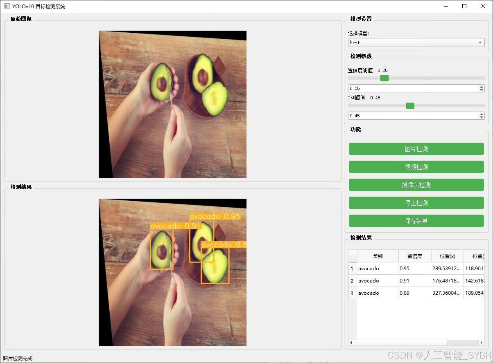
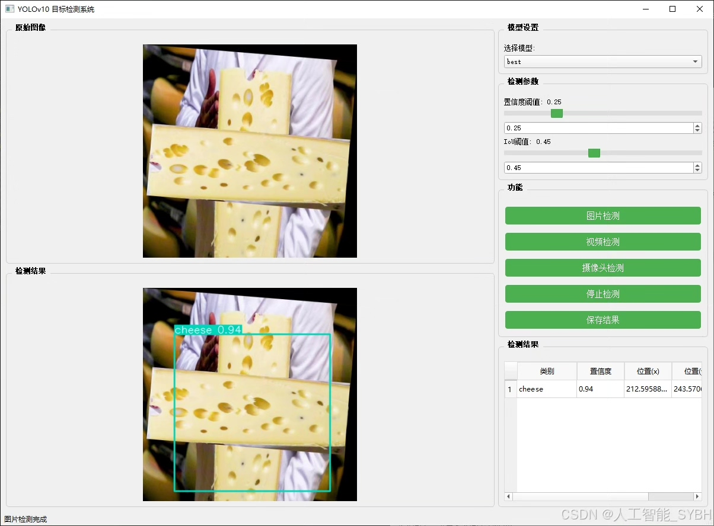
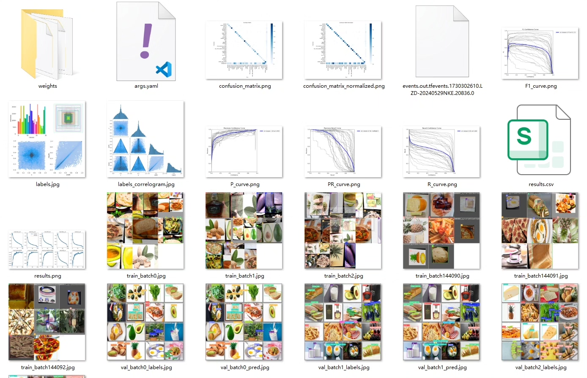
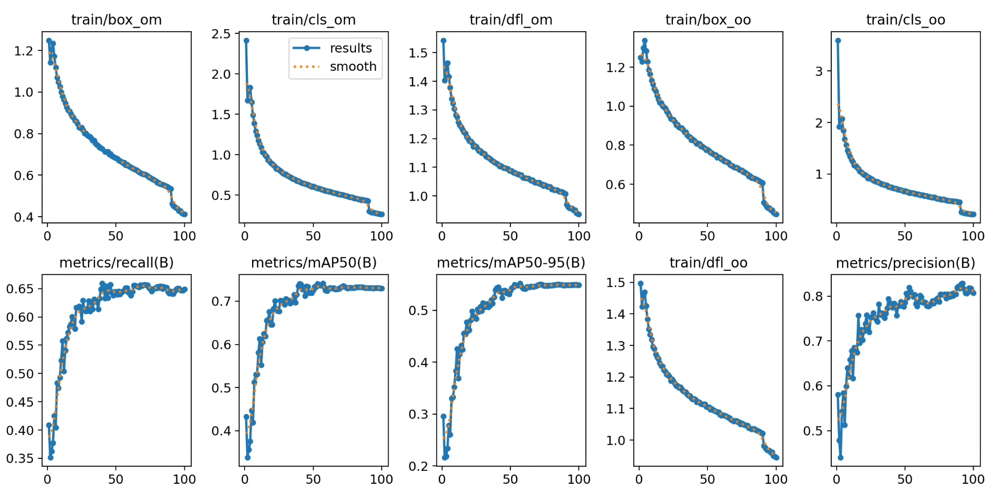
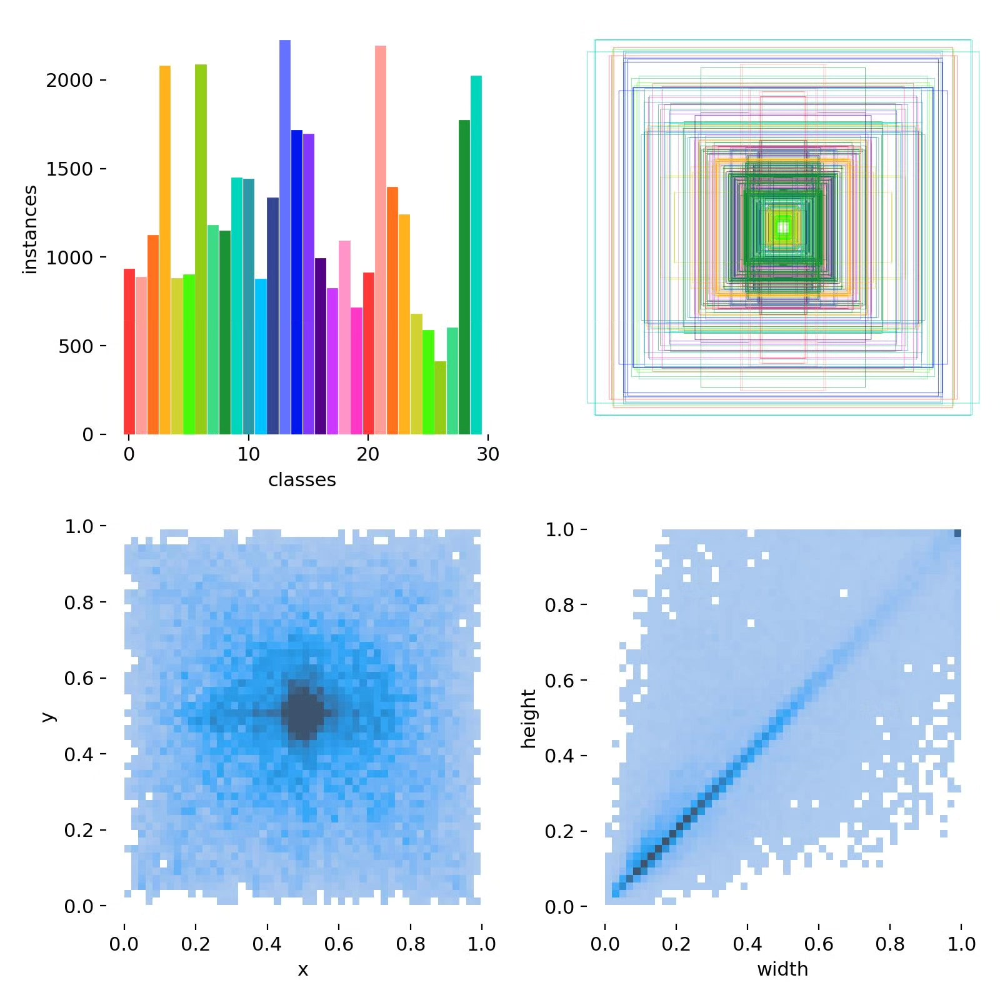
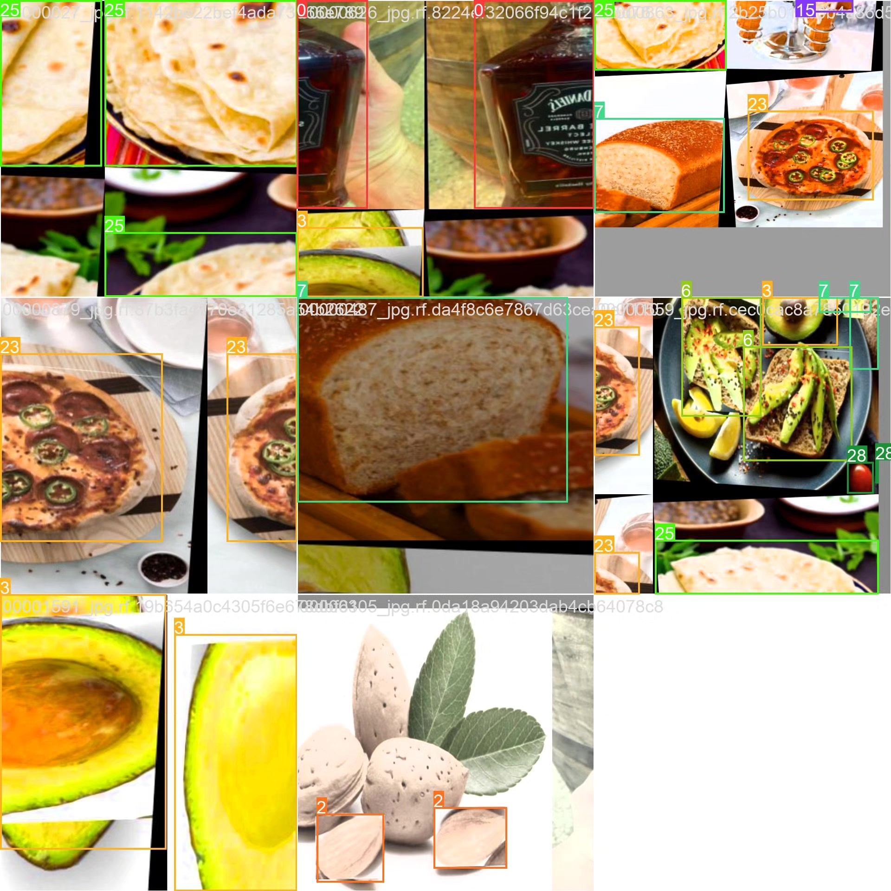
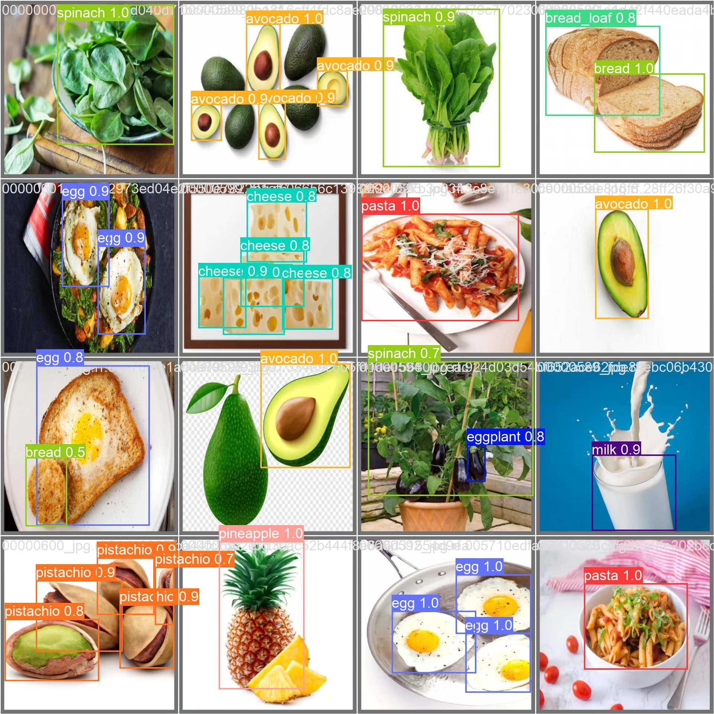
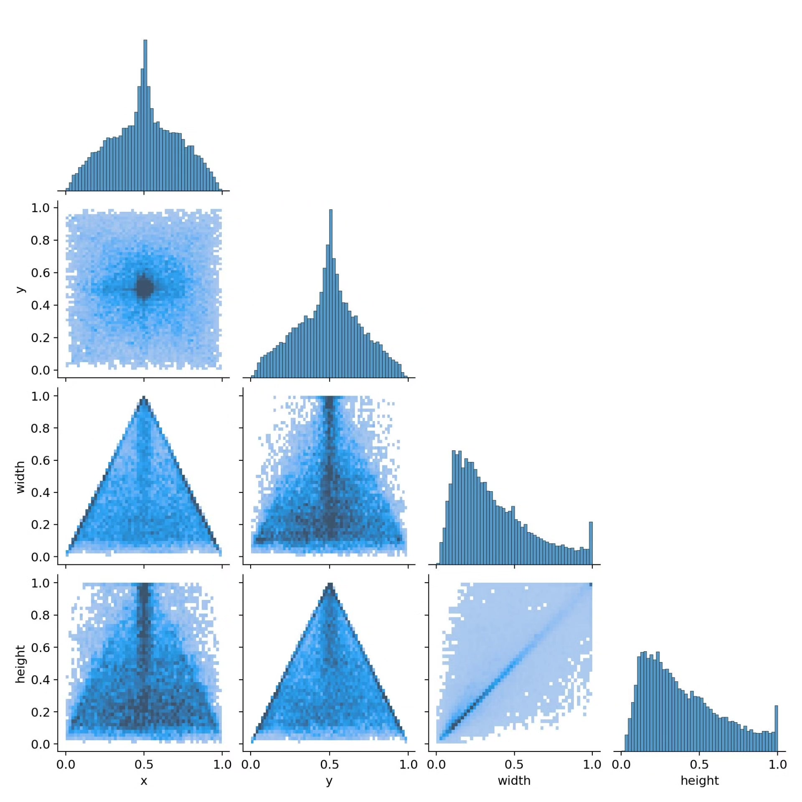

# Food detection system based on YOLOv10 deep learning (YOLOv10+Y)

## Body

YOLOv10 Food Allergen Detection System is a smart system based on the You Only Look Once version 10 (YOLOv10) object detection algorithm, specifically designed for detecting and identifying common food allergens. This system can automatically recognize 30 common food allergens, including nuts, dairy products, eggs, and specific fruits, and classify them accordingly. Through this system, users can quickly identify the allergenic components in food, helping allergic individuals avoid foods that may cause an allergic reaction, thereby improving the level of food safety management.

Training set: 12802 images
Validation set: 1220 images
Test set: 639 images

The company's product has obtained the official commercial license certification from YOLO.

We provide after-sales service.

After payment, we will provide WeChat IDs to answer questions at any time.

Environment configuration: We will provide a tutorial on environment configuration, and WeChat will provide answers to questions.
Remote installation service: If you need remote configuration, an additional fee of 69 is required, with all fees refunded if the configuration fails (only refund installation fees for older computers).
Retraining dataset: After configuring the environment, you can train on your own computer. If you need us to retrain, just pay 69 plus computing power fees (2.5 yuan/hour).

Full after-sales service

## Images

## Payment

Here is a pay link on Stripe ( https://buy.stripe.com/3cs8yP7sY87d0vu9AB ). Please contact me lonlonago@foxmail.com after funding $89, and I will send you a complete data files , thank you!

